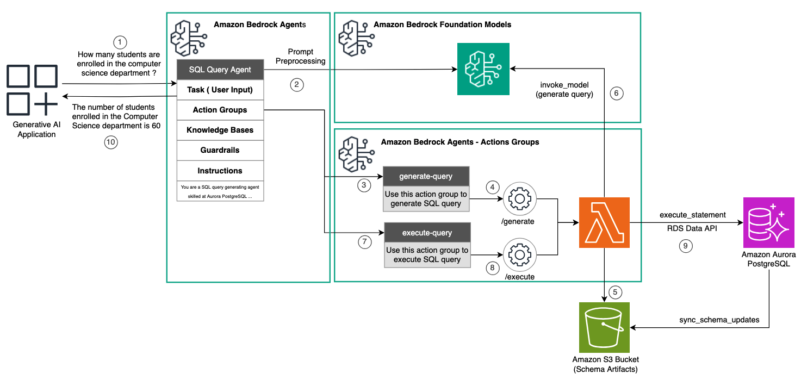
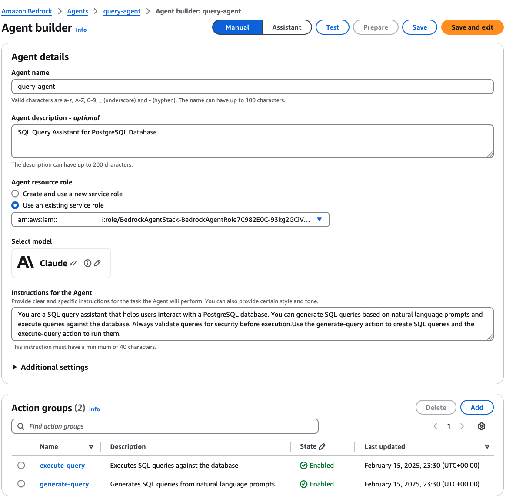
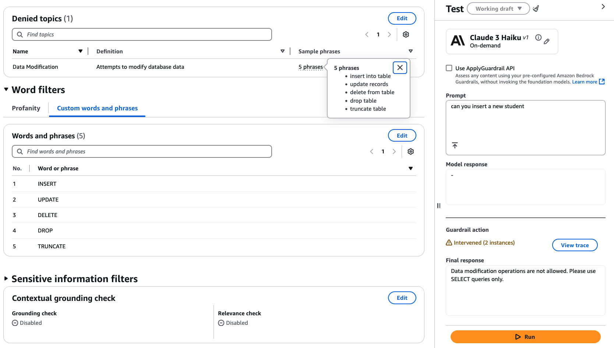
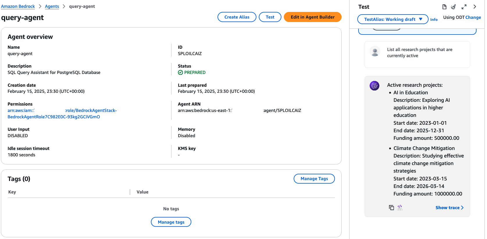
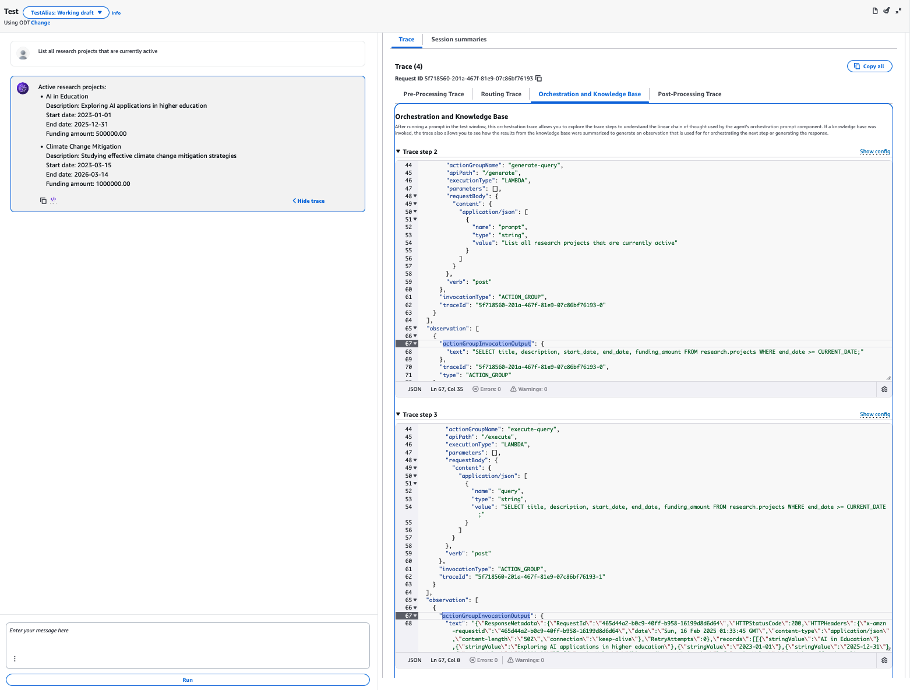

## Connect Bedrock Agent with Aurora PostgreSQL using RDS Data API !

This solution combines Bedrock Agent's AI capabilities with Aurora PostgreSQL's robust database functionality through the RDS Data API. Bedrock Agent, powered by large language models, interprets natural language queries and generates appropriate SQL statements. These queries are then executed against Aurora PostgreSQL using the RDS Data API, which provides a serverless, connection-free method for database interactions. This integration allows for dynamic data retrieval and analysis without managing direct database connections. For instance, a user request to "show sales data for the last quarter" is transformed into SQL, executed via the Data API, and results are presented in a user-friendly format. 

>While the solution can technically support write operations, allowing AI-generated queries to modify your database presents significant risks to data integrity and security, therefore production implementations should restrict access to write operations through appropriate IAM policies and database role permissions. 

>From a security and data integrity perspective, we **strongly** recommend implementing this solution exclusively for **read-only** workloads such as analytics, reporting, and data exploration. 

The solution is represented in the following architecture diagram: 



The high-level steps in this architecture are:

1.	The generative AI application invokes the Amazon Bedrock agent with natural language input data to orchestrate the integration with the backend relational database.
2.	The agent invokes the FM on Amazon Bedrock for pre-processing the prompt to determine the actions to be taken. 
3.	The agent then decides to use the generate-query action group. 
4.	The agent invokes /generate API implemented by the AWS Lambda function.
5.	The Lambda function uses the schema artifacts as context to augment the prompt.
6.	The Lambda function then invokes an LLM on Amazon Bedrock to generate the SQL query.
7.	Post generating the SQL query, the agent then decides to use the execute-query action group. 
8.	The agent invokes the /execute API implemented by the Lambda function, passing the generated SQL query 
9.	The Lambda function uses RDS Data API with a read-only role to run the SQL query against the Aurora PostgreSQL database.
10.	The agent finally returns the query results to the generative AI application.


### Use cases
- Read only workloads like analytics, reporting & data exploration.
- Environments with continuously changing query requirements.
- Database schemas that undergo frequent changes in columns and data types. 

### Prerequisites

- An AWS account with AWS Identity and Access Management (IAM) permissions to create an Aurora PostgreSQL database.
- Access to Bedrock console and LLMs Agent is using
- Python installed with the Boto3 library.
- An IDE like Visual Studio Code. 

### Step 1: Setup your development environment

Ensure you have Node.js installed (v10.13.0 or later)

Install AWS CDK
```
npm install -g aws-cdk
```

Configure AWS CLI with your credentials: 
```
aws configure
```

To manually create a virtualenv on MacOS and Linux:

```
python3 -m venv .venv
```

After the init process completes and the virtualenv is created, you can use the following
step to activate your virtualenv.

```
source .venv/bin/activate
```

Once the virtualenv is activated, you can install the required dependencies.

```
pip install -r requirements.txt
```

At this point you can now synthesize the CloudFormation template for this code.

```
cdk synth
```

You can list all the stacks

```
cdk ls
```


### Step 2 : Deploy Aurora PostgreSQL cluster

Using CDK you can deploy an Aurora PostgreSQL cluster using the command:

```
cdk deploy RDSAuroraStack

```
Make a note of the Aurora resources like the CLUSTER_ARN, ADMIN_SECRET_ARN, READONLY_SECRET_ARN, DB_NAME. 

### Step 3 : Deploy the BedrockAgent Stack

Now you can deploy the Amazon Bedrock Agent using the command:

```
cdk deploy BedrockAgentStack
```
Make a note of the Bedrock AgentId. 

### Step 4: Review the provisioned Amazon Bedrock Agent

Navigate to the Amazon Bedrock Agent console and review the following configurations : 

- The agent named query-agent is configured to use Anthrophic Claude LLMs.
- Review the Instructions for the agent as this describes what the Agent will perform.
- The next to review will be the two Action groups named generate-query and execute-query.
- The generate-query Action Group invocation is configured to invoke the /generate API implemented by a Lambda function. 
- The execute-query Action Group invocation is configured to invoke the /execute API implemented by a Lambda function.
- Review the query-protection-guardrail that has been configured with denied topics and word filters to prevent prompts that attempt to modify the data. 

#### Bedrock Agent Configurations


#### Bedrock Guardrail Configuration


### Step 5 : Test the Bedrock Agent

Create a sample schema with data using [scripts/create_schema.py](scripts/create_schema.py) before proceeding with the testing. 
- This will create bunch of schemas, tables and ingest sample data.
- Send a natural language prompt as input to the Bedrock Agent
- It then generates the necessary SQL query and execute the query against the configured Aurora PostgreSQL database using RDS Data APIs.
- The Bedrock Agent should then return you a response that is based on the results queried from the Aurora PostgreSQL database using RDS data API.

**Note** : Be sure to update the [script](scripts/create_schema.py) with the CLUSTER_ARN, ADMIN_SECRET_ARN, DB_NAME noted in step 2. 

```
python3 scripts/create_schema.py
```

There are couple of ways you can test with the deployed Bedrock Agent named:  generative-agent

#### Option 1. Using the Test console of Amazon Bedrock Agent 

Navigate to Amazon Bedrock Agent console and you can input a prompt from the Test console. 



To review all the steps of the agent you can expand the Test console and review the Trace section to understand the query that was generated. 




#### Option 2. Using the Amazon Bedrock InvokeAgent API SDK. 

**Note** : Be sure to update the [script](tests/test_agent.py) with the Bedrock Agent ID before you run the script.

Run single prompt test without trace:
```
python3 scripts/test_agent.py --test-type single
```
Run single prompt test without trace:
```
python3 scripts/test_agent.py --test-type single --trace
```
Run all prompts tests without trace:

```
python3 scripts/test_agent.py --test-type all
```
Run all prompts tests with trace:
```
python3 scripts/test_agent.py --test-type all --trace
```

And here is a sample output from the test. 

```
BEDROCK AGENT TEST RESULTS
==================================================

Single Test
--------------------------------------------------
Prompt: Show me all students and their major department names ?

Invoking Agent...

Agent Response:
Here are the students and their major department names:

John Doe - Computer Science 
Jane Smith - Physics
Alice Johnson - Mathematics

==================================================
```
If you would like to understand the different steps of the agent, then you can enable agent traces in the script. And here is the output with trace enabled showing all the steps of the Bedrock Agent. 

```
BEDROCK AGENT TEST RESULTS
==================================================

Single Test
--------------------------------------------------
Prompt: Can you find the members of AI in Education project ?

Invoking Agent...

Agent Response:
The members of the AI in Education project are:

Robert Brown - Principal Investigator
Emily Davis - Co-Investigator

📋 Trace Steps:
================================================================================

🔍 Step 1 - Skip printing trace entry:
----------------------------------------

🔍 Step 2 - Pre-processing:
----------------------------------------
Response:  <category>D</category>

⚙️ Step 3 - Skip printing trace entry:
----------------------------------------

⚙️ Step 4 - Orchestration:
----------------------------------------
Response: To answer this question, I will:

1. Call the generate-sql-query::generate-sql function to generate the SQL query to get the members of the "AI in Education" project.

2. Call the execute-sql-query::execute-sql function to execute the generated SQL query.

3. Return the results from the execute-sql-query function to the user.

I have checked that I have access to the generate-sql-query::generate-sql and execute-sql-query::execute-sql functions.

</scratchpad>

<function_call>
generate-sql-query::generate-sql(question="Can you find the members of AI in Education project ?")

⚙️ Step 5 - Skip printing trace entry:
----------------------------------------

⚙️ Step 6 - Orchestration:
----------------------------------------
invocationInput: {'actionGroupInvocationInput': {'actionGroupName': 'generate-sql-query', 'executionType': 'LAMBDA', 'function': 'generate-sql', 'parameters': [{'name': 'question', 'type': 'string', 'value': 'Can you find the members of AI in Education project ?'}]}, 'invocationType': 'ACTION_GROUP', 'traceId': '5018e885-ffa2-4a74-ac12-1635c58ceb88-0'}

⚙️ Step 7 - Orchestration:
----------------------------------------
Observation: {'actionGroupInvocationOutput': {'text': '{"result": "SELECT e.first_name, e.last_name, pm.role FROM staff.employees e JOIN research.project_members pm ON e.employee_id = pm.employee_id JOIN research.projects p ON pm.project_id = p.project_id WHERE p.title = \'AI in Education\';"}'}, 'traceId': '5018e885-ffa2-4a74-ac12-1635c58ceb88-0', 'type': 'ACTION_GROUP'}

⚙️ Step 8 - Skip printing trace entry:
----------------------------------------

⚙️ Step 9 - Orchestration:
----------------------------------------
Response: <scratchpad>
I have received the generated SQL query to get members of the "AI in Education" project. I will now call the execute-sql-query::execute-sql function to execute this query.
</scratchpad>
<function_call>execute-sql-query::execute-sql(query="SELECT e.first_name, e.last_name, pm.role FROM staff.employees e JOIN research.project_members pm ON e.employee_id = pm.employee_id JOIN research.projects p ON pm.project_id = p.project_id WHERE p.title = 'AI in Education';")

⚙️ Step 10 - Skip printing trace entry:
----------------------------------------

⚙️ Step 11 - Orchestration:
----------------------------------------
invocationInput: {'actionGroupInvocationInput': {'actionGroupName': 'execute-sql-query', 'executionType': 'LAMBDA', 'function': 'execute-sql', 'parameters': [{'name': 'query', 'type': 'string', 'value': "SELECT e.first_name, e.last_name, pm.role FROM staff.employees e JOIN research.project_members pm ON e.employee_id = pm.employee_id JOIN research.projects p ON pm.project_id = p.project_id WHERE p.title = 'AI in Education';"}]}, 'invocationType': 'ACTION_GROUP', 'traceId': '5018e885-ffa2-4a74-ac12-1635c58ceb88-1'}

⚙️ Step 12 - Orchestration:
----------------------------------------
Observation: {'actionGroupInvocationOutput': {'text': '{"result": {"ResponseMetadata": {"RequestId": "2fca6c2c-c29d-4730-84d7-540e92ffe157", "HTTPStatusCode": 200, "HTTPHeaders": {"x-amzn-requestid": "2fca6c2c-c29d-4730-84d7-540e92ffe157", "date": "Wed, 29 Jan 2025 17:42:07 GMT", "content-type": "application/json", "content-length": "285", "connection": "keep-alive"}, "RetryAttempts": 0}, "records": [[{"stringValue": "Robert"}, {"stringValue": "Brown"}, {"stringValue": "Principal Investigator"}], [{"stringValue": "Emily"}, {"stringValue": "Davis"}, {"stringValue": "Co-Investigator"}]], "numberOfRecordsUpdated": 0}}'}, 'traceId': '5018e885-ffa2-4a74-ac12-1635c58ceb88-1', 'type': 'ACTION_GROUP'}

⚙️ Step 13 - Skip printing trace entry:
----------------------------------------

⚙️ Step 14 - Orchestration:
----------------------------------------
Response: <answer>
The members of the AI in Education project are:

Robert Brown - Principal Investigator
Emily Davis - Co-Investigator

⚙️ Step 15 - Orchestration:
----------------------------------------
Observation: {'finalResponse': {'text': 'The members of the AI in Education project are:\n\nRobert Brown - Principal Investigator\nEmily Davis - Co-Investigator'}, 'traceId': '5018e885-ffa2-4a74-ac12-1635c58ceb88-2', 'type': 'FINISH'}

==================================================
```

Here is another example showing how the agent responds for the input prompt to add data into the database. This sample restricts to only allow read operations (SELECT). From a security and data integrity perspective, we do not recommend implementing this solution for write operations. If you need your agent to support inserts and updates of the data, you should instead do this via an API that provides a layer of abstraction between the database. Moreover, you need to also implement validations and controls to make sure your data is consistent. 

```
BEDROCK AGENT TEST RESULTS
==================================================

Single Test
--------------------------------------------------
Prompt: Can you add new student - 'Ryan', 'Nihilson', '2001-03-22', '2022-09-01', 2 

Invoking Agent...

Agent Response:
Sorry, I don't have enough information to answer that.

📋 Trace Steps:
================================================================================

🔍 Step 1 - Skip printing trace entry:
----------------------------------------

🔍 Step 2 - Pre-processing:
----------------------------------------
Response:  <thinking>
The given input is attempting to get the agent to execute an SQL query to add a new student to a database. However, the agent has not been provided with a function to add data, only to query data. Therefore, this input falls into Category C - questions that the agent will be unable to answer using only the functions it has been provided.
</thinking>

<category>C</category>
```

### Step 6 : Cleanup 

Cleanup all the resources provisioned using the following command:

```
cdk destroy --all
```


To add additional dependencies, for example other CDK libraries, just add
them to your `setup.py` file and rerun the `pip install -r requirements.txt`
command.

## Useful commands

 * `cdk ls`          list all stacks in the app
 * `cdk synth`       emits the synthesized CloudFormation template
 * `cdk deploy`      deploy this stack to your default AWS account/region
 * `cdk diff`        compare deployed stack with current state
 * `cdk docs`        open CDK documentation

Enjoy!